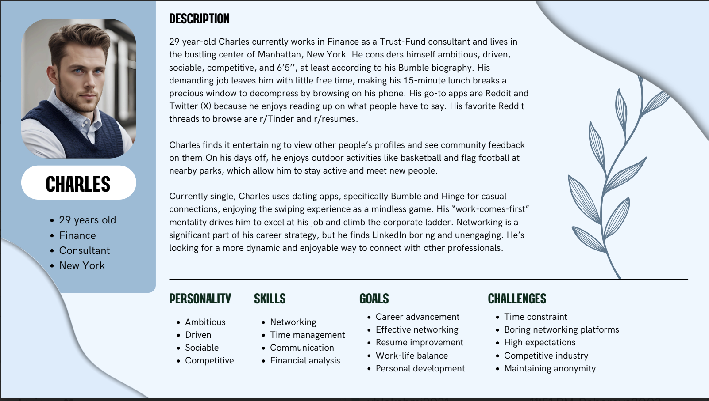
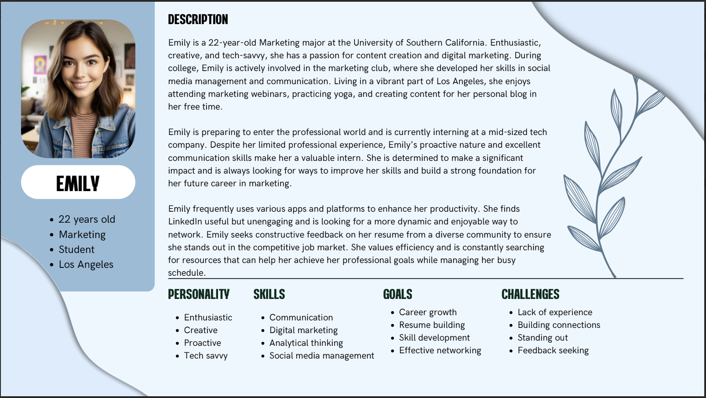

# LinkUp - Transforming Resume Reviews into Opportunities!

## Our Idea
### The Problem and Our Solution:
In today’s competitive job market, a standout resume can make the difference between landing an interview and being overlooked. However, many job seekers struggle to create impactful resumes due to a lack of constructive, specific feedback. Our platform solves this problem by providing a unique environment where job seekers can anonymously receive feedback on resumes from a diverse set of peers and industry professionals facilitating a more effective resume refinement process in a supportive community environment.

### Our Product:
We are developing a website that enhances resume development through community-driven feedback and professional networking. Our platform enables users to anonymously upload their resumes and interact with a diverse community of peers and industry professionals via  a simple swipe mechanism: swipe right to give feedback and connect professionally, or swipe left to skip. Mutual right swipes result in a match, allowing both users to engage in direct messaging for deeper reviews and networking opportunities.

### Features:
Key features of our platform include the ability to upload resumes in multiple formats (PDF, PNG, DOCX) while maintaining user anonymity through generated anonymous usernames and blurring out confidential information. Users can customize feedback settings, fine-tuning the type of resumes that appear on their main page based on criteria such as location and experience level. Additionally, users can explore top trending resumes to gain insights into effective resume strategies that are resonating in the job market. When a user swipes right on a resume, they can leave a review and comment, which the resume owner can view and decide whether to connect. The platform also includes a direct messaging (DM) feature, allowing users to connect and communicate directly when there is mutual interest, facilitating further discussions and detailed resume reviews.

### Some Possible Use Cases:
A job seeker in the marketing field uses insights from community feedback on trending resume formats and strategies to tailor their own resume. As a result, they experience an increase in job interview invitations due to a more compelling and effective resume presentation.

A hiring manager, by actively providing feedback and observing emerging resume trends on the platform,  enhances their recruitment tactics. This continuous learning process helps them stay ahead in their industry by recognizing and attracting top talent more effectively.

A recent graduate receives feedback from users who swipe right on the recent graduate’s resume. By getting feedback from other users and their own comparisons with top trending resumes, they refined their own resume to better showcase their skills and experiences, successfully bridging the gap between their academic achievements and professional expectations.

This streamlined platform not only facilitates targeted resume improvements but also fosters meaningful professional connections, enhancing career prospects in a supportive, user-centric environment.

### Future Integrations: 
In our later stages of our app, we plan to enhance our platform by introducing features like video and voice chats, enabling mock interviews, and making it more approachable for users to connect and learn from other professionals. Our ultimate goal is to facilitate deeper and more reliable connections in the workforce, going beyond surface-level interactions. 

### Check out the Figma prototype to see our vision for the product and its early design:
<ins>**[LinkUp - Figma](https://www.figma.com/design/0iETezP6dJLcd5efMPoop3/CSCC01-%7C-Link-Up-Prototype?node-id=0-1&t=hAfJGcwDgsPLW2RY-1)**</ins>

## Our Target Audience

As of 2023, the global professional networking apps market is valued at USD 67.28 Billion and is projected to grow at at rate of 26%, reaching an estimated USD 270.65 billion by 2030. The majority of LinkedIn users, one of the largest platforms for online professional networking, are Millennials and GenZ, aged 18 to 34 years old. Therefore, it makes sense for our app to cater towards the interests and tech-savvy nature of this demographic.

Our application addresses the growing need for professional networking by providing a unique platform for young adults who are currently working or seeking opportunities. In the early stages of our application, we aim to target casual users such as busy professionals and recent university graduates who enjoy networking but don’t like the traditional corporate formality. 

### Scenario 1- Lunch Break Networking:
Charles is on his 15-minute lunch break at his office in Manhattan. He pulls out his phone and opens the resume feedback website. He swipes through a few resumes, giving quick feedback and swiping right on a couple that catch his interest for potential networking. Charles enjoys the process, finding it engaging compared to the usual dull LinkedIn browsing. He matches with another finance professional and starts a brief conversation, planning to discuss further after work. This helps him efficiently use his short break for productive networking.

### Scenario 2- Internship Application:
Emily is applying for a summer internship at a major marketing firm. She uploads her resume to the app and selects preferences to receive feedback from marketing professionals. Over the next few days, Emily receives several detailed reviews, including tips on showcasing her social media management skills more effectively. She uses this feedback to refine her resume, increasing her chances of landing the internship.

## Why Choose Our Product

Today, many students and young professionals struggle to find jobs and opportunities, especially with the current trends in the job market. The unemployment rates have been increasing and many people have been facing a lack of job postings, layoffs and a struggle to grow professionally. The lack of opportunities has caused increased competition and a desire for these job seekers to stand out, however there are not many resources that they can consult  to improve how they present themselves. The current market offers resources such as LinkedIn, however the purpose of LinkedIn is to form a professional network, not improve your professional image. There are also online forums to ask for advice, however these often come with many hateful comments, a struggle to find reliable advice, and no anonymity. Thus, LinkUp fixes these problems by providing a platform for professionals and job seekers to form as one and help each other by providing useful feedback on each other's resumes anonymously.	

First of all, LinkUp maintains anonymity among users, by blurring out names and providing auto generated usernames. Thus, users do not have to worry about sharing their resumes openly in fear of judgment, embarrassment or competition. This creates a safe space for users to gain constructive comments and criticism from others without feeling anxious or pressured by other users. 

Not only that, but LinkUp is open to people of all ages, backgrounds and careers. By setting your preferences for the type of resumes you would like to see, you can be exposed to a variety of people who can benefit your job search. For example, you may get a professional with years of experience to review and comment on your resume, as well as benefit from looking at their resume. You also might want to see the resumes of other people who are currently job seeking in your field too. You have the ability to connect with these users, and see a broad range of opinions, insights and expertise to improve your resume. Thus, users have the ability to not only network as you would do in a social media site, such as LinkedIn, but also feel comfortable to ask for advice and improvement.

Furthermore, our application also offers a page to showcase trending resumes, so that you can see what job searchers and professionals are currently interested in. This allows you to gain insight on the job market as a whole and possibly change your view on how you should customize your resume.

LinkUp takes inspiration from your average dating app interface, offering a fun swipe-based interface that allows users to swipe left or right on resumes, leaving comments to connect with people you want to further a connection with. Then, the other user can review the comments they receive and also agree to continue a connection with this user and review each other's resume, or decline the offer. Thus, this interface provides a fun, engaging way to connect with others professionally. This allows you to feel more interested and committed to interacting with each other, and helping each other gain insight from the match.

## What Does "Done" Mean to us?

"Done" means that all necessary functionality and requirements of all user stories have been successfully implemented to meet our high standards of quality, functionality, and usability. For our project, this implies that users should be able to seamlessly sign up, log in, and manage their accounts. New users should have the ability to set preferences for viewing different types of documents right from the start, customizing their experience on the platform. Registered users should be able to upload, manage, and delete multiple resumes in various formats, ensuring flexibility and convenience.

Each user story must meet comprehensive criteria: the code should be written, documented, and peer-reviewed, following our coding standards. We ensure that extensive testing is performed, including unit, integration, and user acceptance tests, with all identified bugs fixed. The documentation is carefully updated to reflect new features and changes to existing functionalities. The user interface must be in line with our design specifications and flows in Figma.

This detailed definition of "done" ensures that each feature, such as swiping left or right on resumes, viewing and leaving comments, and engaging in private conversations, works flawlessly. It also covers advanced functionalities like editing preferences, blocking users, and interacting with trending documents.

## Highlights

When coming up with ideas for our product, we held several meetings to brainstorm ideas, the features we want to include and what would optimize our success the most. Before narrowing down our ideas, we each brainstormed our own ideas and posted them to a Miro board to discuss in a group meeting. After narrowing down our ideas, we discussed the doability of each of them, and initially landed on the idea of creating a resume roasting application. In this idea, people would be able to post their resumes in a public forum and any user could comment under the resume and voice their opinion, similar to a Reddit post. Although the idea seemed engaging and fun for users, we realized that this had several cons. For one, a user might not want to display their professional information on such a public forum for both privacy issues, as well as for fear of judgment. From viewing websites such as Reddit, it is clear that people can take advantage of comments and use them to hate rather than provide useful comments. Not only that, but an interface such as this one could allow for irrelevant comments from people who may not know what actually would benefit someone in a certain field searching for a job. Therefore, we decided to introduce the idea of using anonymity, as well as having private comments, rather than a public forum. This led us to our current idea of our LinkUp interface. Now people can comment directly to a job seeker and the comments only get accepted if the job seeker wants to connect with this person, based on viewing the other’s resume and comments.

Another decision we had to come up with while narrowing down our idea  was how we wanted to present resumes. Some members wanted to follow a format similar to Instagram, where you post your resume and get roasted in the comments. This would mean that although you are private, other people you connect with can see all your comments. We decided that this should not be the case, since we want to be able to foster connections from these comments, and so allowing these comments to go directly to a private message opens room for discussion and interaction. Not only that, but we wanted to make users comfortable and not overthink making connections and accepting advice, and so having an Instagram-style system may make users overthink who they accept onto their page. 

Finally, another key decision we had to come up with was whether we wanted to have a leaderboard. Initially, some members of the group suggested having a leaderboard, where users would be ranked publicly on a scale, based on the number of positive comments. For example, if one user had fifty people who liked their resume, then they might be first on the leaderboard, and if someone had two people who liked their resume, they might be thirtieth, and so forth. Although this would have been a good way to gamify our concept, we found that this might discourage participants and take away the safe space that we are trying to create. Furthermore, we concluded that instead of a leaderboard, we should have a few trending resumes that could be viewed publicly (with the user’s consent). This way, people can benefit from the best resumes and gather tips on how to improve their own resume. This diminishes putting others down and helps all the young aspiring professionals on LinkUp.

Furthermore, throughout our meetings, we finalized our idea of LinkUp, discussing other small features and ideas that we could possibly include. Our team has been working together from previous projects and knew we would work great together to create LinkUp. We met up two times every week to come up with our idea, discuss features and prepare for sprint 0. We created a Discord server to communicate and organize our thoughts, as well as a Google Drive folder to organize our documents. We also created a GitHub repository through the GitHub Classroom link, as instructed to. Finally, we used Figma to create our prototype,We are using a shared project to collaboratively develop the pages assigned to each of us during our meetings.Altogether, we were able to draft a detailed prototype and gain a clear understanding from our work done in Sprint 0, which helped us familiarize ourselves with our application and be prepared to carry on our vision for LinkUp!

### Here is a Miro Board we created during our planning to help decide and discuss different ideas:
<ins>**[LinkUp - Miro Board](https://miro.com/app/board/uXjVKGPfJI4=/?share_link_id=672297535074)**</ins>
