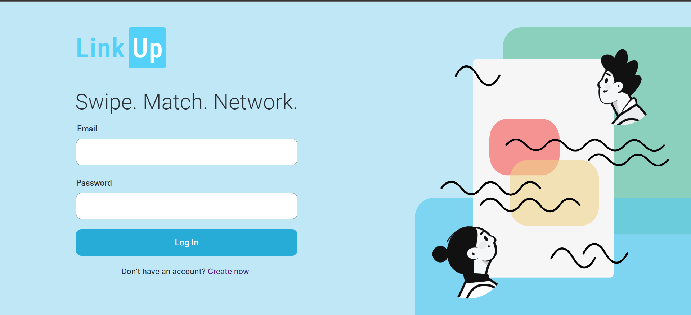
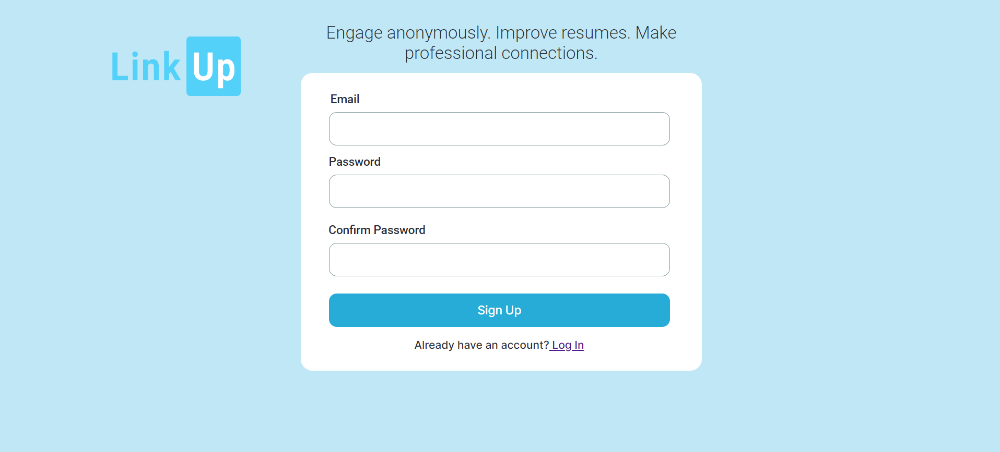
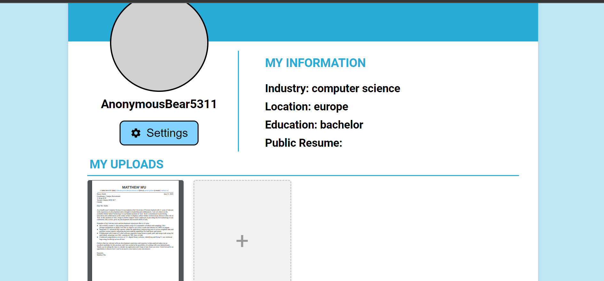
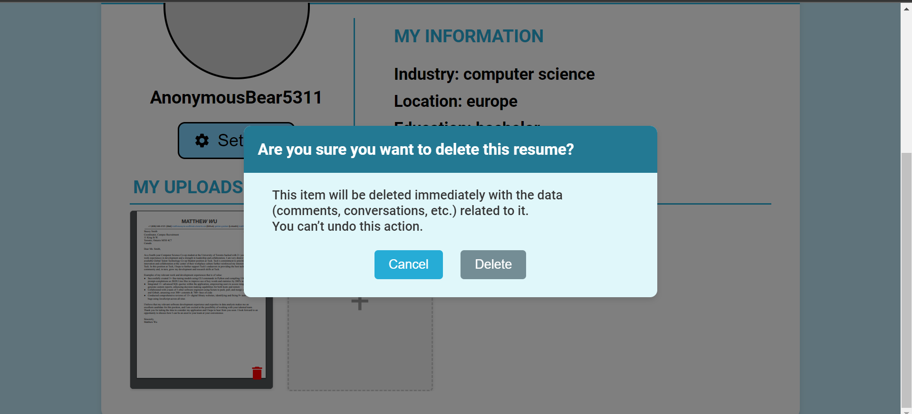
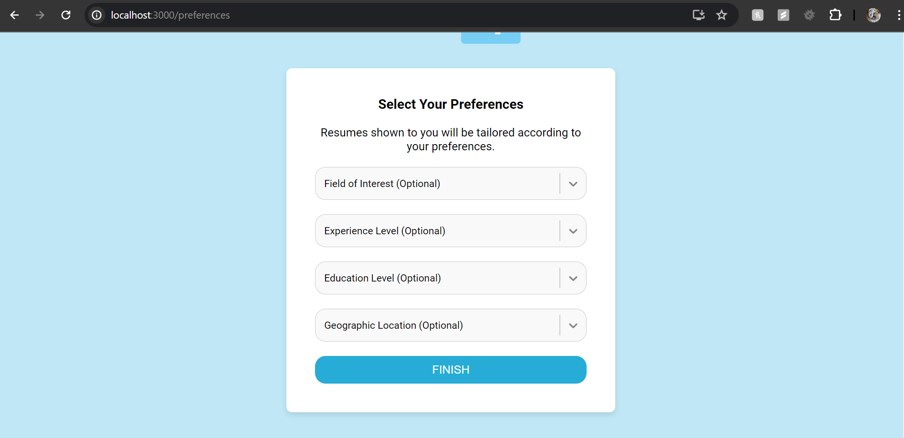

# LinkUp - Iteration 01 Review Meeting

## Iteration 01 - Review & Retrospect

 * **When**: 6/15/2024
 * **Where**: Online (discord)

## Process - Reflection

#### **Decisions that turned out well**
Here are team organization decisions that turned out to be successful:

- **Prioritization of Tasks**: Since we knew that the Signup and Login pages and resumes were a crucial part of our application, we focused on ensuring that whoever was working on it had adequate time to work on it. Ashtian and Keerthiha were assigned to work on those features respectively. If they experienced any blockers, we would first address those issues before continuing to implement our other required features for Sprint 1. Moreover, Matthew’s assigned task (anonymous username generation) and Vaibhav’s task (setting user’s preference to customize the resume’s shown to the user) was contingent on the implementation for the Signup process; thus, it was crucial that we had the Signup and Login pages up and running first. 
- **Use of Discord Server**: Our Discord server proved to be a vital hub for communication and collaboration. It was extremely convenient for us to collaborate in our Discord server because all members would regularly check it, and also if we were in the middle of a discussion, we could quickly hop in one of our voice channels to continue off of our discussion that we would be having in one of our text channels. Utilizing our Discord server made decision-making and resolving blockers easier. 
- **Jira Task Management**: As a team, we utilized the KANBAN board well. For one, members didn’t need to know what other members would be working on because they could just refer to the KANBAN board. Moreover, the KANBAN offered a medium to visually track team progress for Sprint 1. For the resume uploading, we knew that that task would be the most complex for this sprint, so we had Bahar support her on this task. 

#### **Decisions that did not turn out as well as we hoped**
- **Merging and Testing Branches a bit late**: We had four main feature branches for this sprint. We ended up merging these branches to the develop branch the day before our demo. One major issue that we ran into was the resume upload feature no longer working after merging into the develop branch. We later found out that it was due to dependency discrepancies between the packages being used and also some packages not being installed after merging. This issue could have been mitigated had we merged the branch sooner and tested whether it was operating. We found that since there were so many potential variables that could have caused the resume upload feature to not work (since we merged all the changes in one sitting), it made debugging much harder and time-consuming.
- **Lack of Documentation**: Since members are often working on tasks independent of each other, it’s hard to support other members in resolving their blockers when we don’t know what’s going on with their tasks. More thorough documentation can streamline this process, making it easier to get familiarized with each other’s work. 

#### **Planned changes**

- **Commit changes more often**: Since we found it to be stressful to encounter issues with our code the day before the demo, we agreed that these issues can be mitigated if we more frequently commit (while also rebasing and squashing when necessary) to our feature branches. 
- **Test changes more often**: In the same vein, we want to also test our feature branches more often. Often, members can be testing another member’s branch and have it not work as intended where on that member’s machine, it works perfectly fine. Once again, we want to mitigate any occurrences of last minute debugging and updates to our codebase. 

## Product - Review

#### **Goals and/or tasks that were met/completed**:
**User Registration and Login**: 

 

**Resume Uploading and Deleting**:

 
**Setting user preferences**:

#### **Goals and/or tasks that were planned but not met/completed**:
- **Profile Page**: We haven’t gotten to finalizing the Profile Page. We haven’t gotten to displaying only the current user’s uploaded files. In addition, users aren’t able to choose what resume they want to be public. As a team, we felt that it wasn’t important for this sprint since we could still satisfy our user stories that we had allocated for this sprint. 
- **Landing Page**: We need to implement a condition where if a logged in user has already uploaded a resume, they are met with the swiping view of our landing page. This feature is part of our Sprint 2, so we’ll focus on that in the coming weeks. 

## Meeting Highlights
Going into the next iteration, our main insights are:

- **Building with our long-term goal in mind**: We want to build our features more with intention for the upcoming sprints. We would be excited to get each feature working, but some issues like wrong page routing and user flow would get swept under the rug. We want to ensure that each member is building each feature according to what we agreed on and what we have mapped out on our Figma prototype. 
- **Member Workload Distribution**: We felt that some members had to do more heavy lifting in terms of their feature they were assigned to. To accommodate for that, we hope to balance out every member’s task by assigning members with the less time-consuming features to the various sorts of write ups that are required for each sprint.
- **Test and merge more frequently**: We hope to test more frequently to mitigate any situations where there are big merge conflicts that are tricky to resolve or complex bugs. As mentioned previously, we want to avoid any last-minute surprises. 

