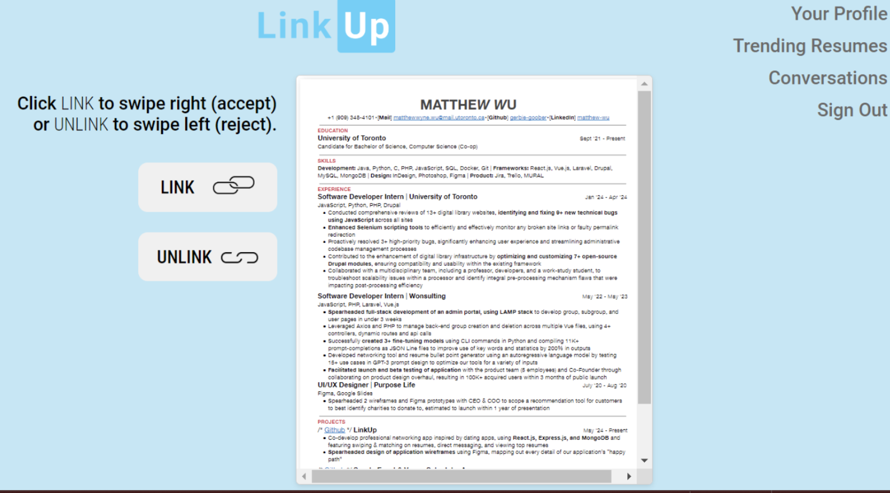
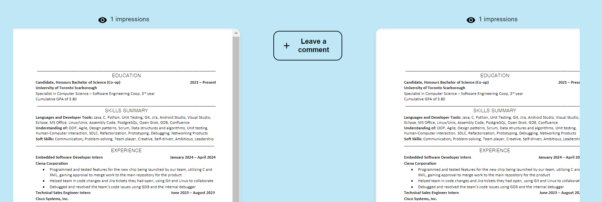
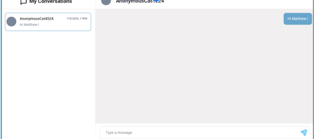
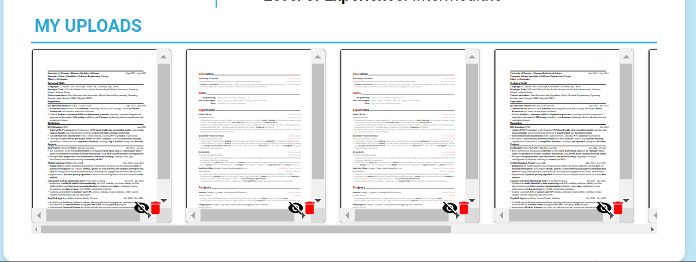
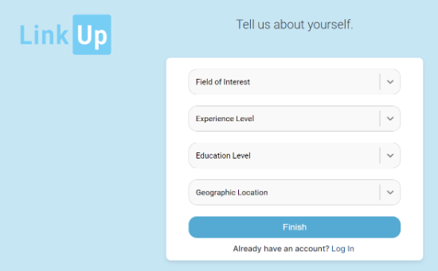

# LinkUp

## Iteration 02

* Start date: 21/06/2024
* End date: 05/07/2024

## Process

Our process for Linkup involves using agile methodologies to ensure iterative development and continuous improvement. We hold regular planning and review meetings and use a Kanban board to track progress.

### Changes from previous iteration

#### 1. Earlier Branch Merging and Testing
**Reason for Change:** We previously faced a major issue where the resume upload feature stopped working due to dependency discrepancies and missing packages after merging multiple feature branches the day before our demo. This made debugging difficult and time-consuming.  
**Expected Outcome:** By merging branches earlier and testing more frequently, we aim to identify and resolve integration issues sooner.

#### 2. Improved Documentation
**Reason for Change:** Lack of thorough documentation made it difficult for team members to support each other and resolve blockers, as it was challenging to understand the status and details of each other’s tasks.  
**Expected Outcome:** More thorough and regular documentation will streamline the process of getting familiarized with each other’s work, making it easier to collaborate and assist with blockers.

### Roles & Responsibilities

#### Scrum Master
The team member who delegates tasks to members, starts sprints, and ensures that we have completed and prepared all the necessary files and documents for submission.

#### Repository Manager
The team member who makes sure other team members are making pull requests, updating issues, and merging and creating branches safely.

#### Developers
Team members who are responsible for writing and testing code that they create; they are assigned to a task listed on the KANBAN Jira Board.

#### Designers
Team member(s) who are responsible for maintaining the Figma prototype, ensuring that all fonts, sizing, and colors are uniform across all pages.

#### Note Takers
Team member(s) who are responsible for summarizing discussions during in-person or on-call meetings.

### Events

#### When and where? In-person or online?
We plan to have at least one weekly in-person meeting and conduct online meetings if need be.

#### What's the purpose of each meeting?
The purpose of each meeting is to discuss topics that require everyone’s approval, whether that be changes to the UI of a page or changes to the flow of our app. In addition, we may discuss technical blockers that team members require support with and database management and scaling in consideration of added features to our app. Nearing the end of each sprint, we will conduct a code review/merge session where the repository manager will attempt to merge all feature/bugfix branches to the develop branch. During the process, the repository manager may need to consult other team members, where most if not all will be present online or in-person, to resolve merge conflicts.

### Artifacts

#### Artifacts can be To-do lists, Task boards, schedule(s), etc.
* We mainly rely on our KANBAN board to track members’ progress on their assigned task.
* Tasks are prioritized using the label feature within the KANBAN board on Jira, setting the tasks to High, Medium, or Low. They are evaluated based on how integral they are to the app’s core functionality (i.e. whether the app can work with or without accomplishing that task).
* To keep track of what tasks have been solved, we use the Issues and Pull Requests Tab within our Github repository. Issues listed in our Github repository mostly correspond to the tasks assigned to team members in our KANBAN board. These types of issues will be updated when a team member replies to that issue with the Pull Request link. Then, they will be resolved once the repository managers validate the PR and accept or reject the merge depending on the circumstances.
* Additional issues, such as bug fixes, database table needs to be set up, etc. will be also listed on the Issues tab. These types of issues will be resolved with Pull Request or a written response to that issue.

### Git / GitHub Workflow

Our team uses a feature-branch workflow to manage our codebase and avoid conflicts. The process is as follows:

1. **Branch Naming:** Branches are named using the format `feat/(Linkup ticket number) - concise name that describes the feature` (e.g., `feat/LC-11-add-login-page`).
2. **Development:** Each feature is developed in its own branch. This ensures that work is isolated and can be reviewed independently.
3. **Pull Requests:** When a feature is ready for review, a pull request (PR) is created from the feature branch to the `develop` branch.
4. **Code Review:** PRs must be reviewed by a team member.
5. **Merging:** Once approved, the PR is merged into the `develop` branch by a designated team member.
6. **Continuous Integration:** After merging, we test.

**Reason for Workflow:** This workflow ensures that code changes are thoroughly reviewed, reducing the likelihood of introducing bugs. By isolating features in their own branches and using clear naming conventions, we maintain a clean and organized codebase.

## Product

### Goals and Tasks

#### User Stories

1. Enable direct messaging.
2. Implement resume swiping functionality for personalized browsing.
3. Ensure user anonymity by hiding name and contact information on resumes.
4. Allow users to view trending documents.
5. Improve user registration process by collecting personal information for better resume matching.
6. Provide zoom functionality for document viewing.

#### Tasks

1. **Enable Private Conversations (LC-25)**
   - Task: Implement a feature that allows users who have matched to start a private one-on-one conversation.
   - Assigned to: Ashtian

2. **Resume Swiping Functionality (LC-24)**
   - Task: Develop functionality for users to swipe left (reject) or right (wanting to match) on resumes.
   - Assigned to: Matthew

3. **Ensure User Anonymity (LC-23)**
   - Task: Implement a feature that keeps registered users' names and contact information confidential on public resumes.
   - Assigned to: Vaibhav

4. **View Trending Documents (LC-27)**
   - Task: Allow registered users to view trending documents and see which documents are gaining traction.
   - Assigned to: Bahar

5. **User Registration Process (LC-38)**
   - Task: Enhance the registration process to collect personal information for more accurate resume matching.
   - Assigned to: Vaibhav

6. **Zoom Functionality for Documents (LC-26)**
   - Task: Enable users to zoom in on documents for better content viewing.
   - Assigned to: Keerthiha

### Artifacts

#### Artifact #1: Figma Prototype
*Illustrates every possible page of our “happy path.” Team members can directly refer to our Figma Prototype when building the UI of their designated task(s) or page. In addition, stakeholders can understand our vision for our app–from the app aesthetics to the user flow.*

#### Artifact #2: Database Design Document
*Maps out the relations between schemas. This document showcases our thought process in storing user and resume data. For team members, this document outlines how we should store data, so that when, for example, we need to keep track of the impressions (views) for user resumes, the document will clearly show how to retrieve that information.*

#### Artifact #3: Readme file and other forms of documentation
*Acts as a one-stop shop for our pitch, means of contribution, running our app, etc. If stakeholders want to learn about our app in a holistic view, our Readme includes our pitch: our purpose and how it works. In addition, if they want to better understand our target users and long-term vision for our app, they can refer to our product.md file and our personas. If they want to contribute to our long-term vision, they can refer to the Contributions section in our Readme file to learn how to responsibly contribute to our codebase.*

### Screenshots of Our Implementation for Sprint 02

#### Being able to swipe left (reject) and swipe right (wanting to match) (LC-24)
On the landing page, users are able to see public resumes of other users. Users can link or unlink with the current resume displayed. If both users link with each other’s resumes, they are considered a match and can begin direct messaging each other.

#### Being able to view trending resumes (LC-27)
Trending resumes are determined to be from users who have a large number of impressions. Users with the highest number of impressions are displayed starting from the left, with resumes ordered from highest to lowest impressions.

#### Being able to direct message other users you have matched with (LC-25)
Users are able to send plain text messages with one another. Users are able to receive the messages in real-time. Users are notified of unread messages, and once messages are read, the notification vanishes.

#### Being able to blur names and other personal information on resumes (LC-23)
The contact info is hidden on the resumes.

#### Being able to provide personal information (LC-38)
Similarly to the “My Preferences” page, a user is able to set their personal information regarding their field of interest, work experience level, location, and education.

#### Being able to zoom into resumes (LC-26)
They can click on their resumes to have an enlarged view.
