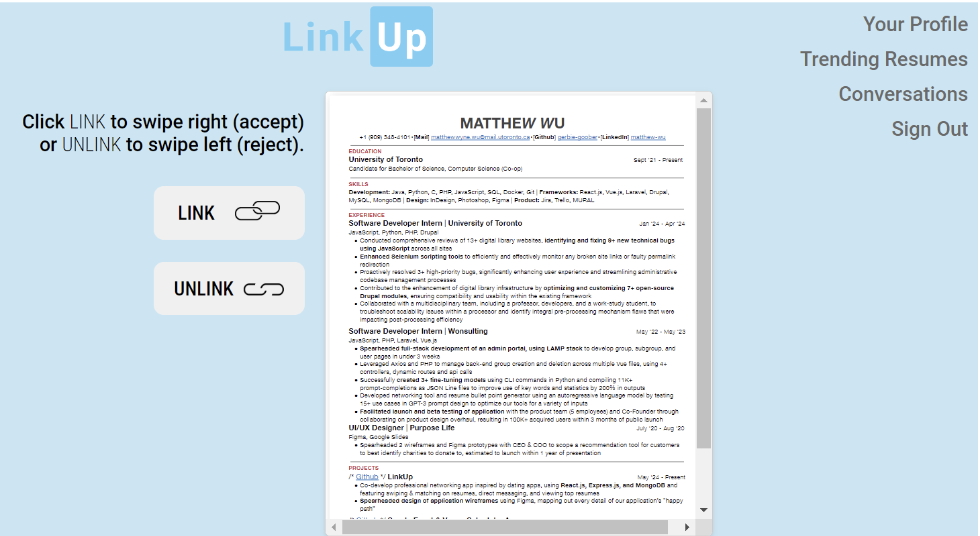
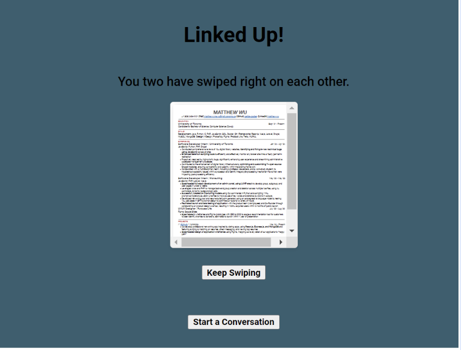
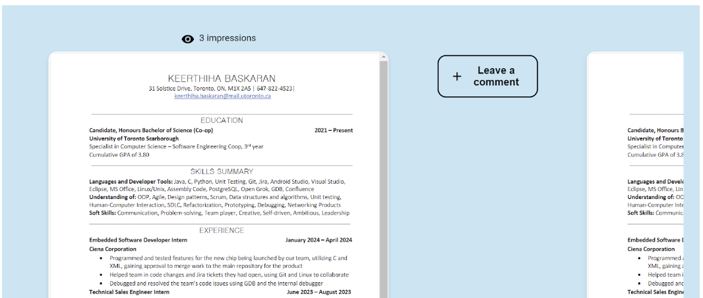
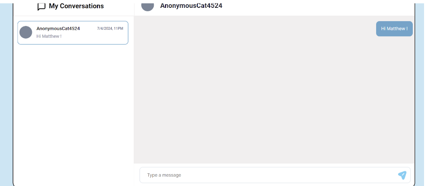
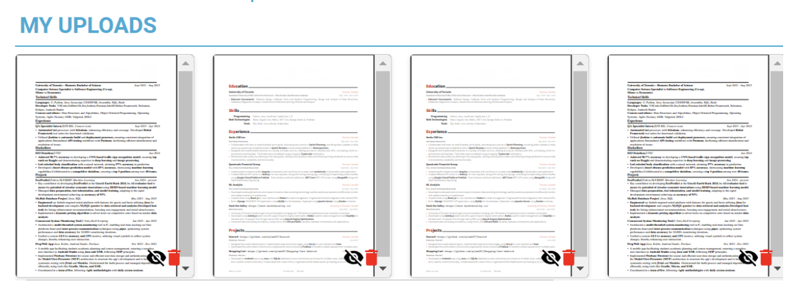
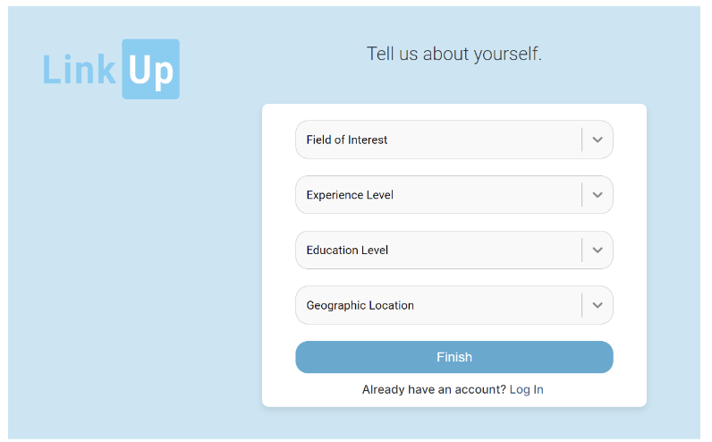
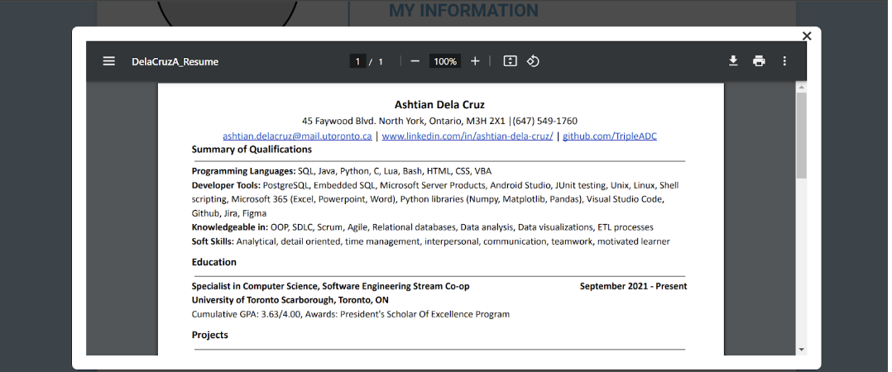

# Link Up

## Iteration 02 - Review & Retrospect

 * When: 7/05/2024
 * Where: Online (discord)

## Process - Reflection

### Decisions that turned out well:

#### Time Management:
	
Effective time management was pivotal in ensuring that our team met all project deadlines while maintaining a high standard of work. We knew that all members of the group had midterms or co-ops to work on, so we started planning for Sprint 2 immediately at the end of Sprint 1. We not only planned out when we would have smaller deadlines, but we also updated each other regularly about issues and were always available for team calls. This sprint definitely helped us work as a team and learn to incorporate each others’ schedules into one that worked for all of us.

#### Folder Management:
	
Effective folder management was crucial in maintaining organization and ensuring that all team members had access to the necessary resources and documents. We established a clear folder structure and naming conventions. All backend documents went into a backend folder, all frontend documents went into the frontend folder, and within these folders, we maintained subfolders based on their purpose. For example, for modals, we established a “hooks” folder. For frontend pages, we created a “pages” folder. We also named our files to be very detailed to ensure no confusion between group members when fetching branches or merging. 
	
#### Extra Hands:
	
To ensure that people who were in charge of larger tasks did not feel too stressed, we had members with easier or less-priority tasks stay available to help other members with more difficult tasks if needed. This helped members feel more relaxed when developing, and created better collaboration efforts between members.

### Decisions that did not turn out as well as we hoped List process-related (i.e. team organization) decisions that, in retrospect, were not as successful as you thought they would be:

#### Styling inconsistencies:

Not adhering to a common styling convention across all pages makes it difficult for team members to modify or fix pages created by others. Additionally, it leads to inconsistent styling across different screen types. While some variation is expected, not using a common convention could exacerbate the issue.

#### Constantly requesting information from the server: 

For certain user stories, like direct messaging, we initially planned to frequently request data from the servers and immediately update the front-end. However, due to the limitations of asynchronous functions and latency between the server and the front-end, immediate updates proved to be unfeasible.

### Planned Changes:

#### Collaborate more often: 

Learning from the previous sprint, we have tested each other’s branches more frequently to ensure they work on everyone’s devices. However, since each member’s user stories’ are still largely unrelated from one another, there is not much incentive to collaborate closely unless it revolves testing. As a group going forward, we want to understand each other’s code on a deeper level. We want to mitigate any occurrences of last minute debugging, misunderstandings, and updates to our codebase. 

#### Documenting code:

In the same vein as the previous point, in order to understand each other’s code better, we aim to comment our code, especially for operations that aren’t intuitive or use external libraries. 

#### Changing strategies regarding requesting information from the server:

To reduce the amount of requests and lag between the front-end and back-end, we decided it would be more effective to retrieve all relevant data at once when the page first loads or for less frequent actions. This strategy is especially useful for pages where the user can do multiple actions in quick succession and require immediate feedback, such as in the direct messages page. 

## Product - Review

### Goals and/or tasks that were met/completed:

#### Being able to swipe left (reject) and swipe right (wanting to match) (LC-24):
On the landing page, users are able to see public resumes of other users
Users can link or unlink with the current resume displayed. If both users link with each other’s resumes, they are considered a match and can begin direct messaging each other

#### Being able to view trending resumes (LC-27):
Trending resumes are determined to be from users who have large number of impressions
Users with the highest number of impressions are displayed starting from the left; with resumes ordered from highest to lowest impressions

#### Being able to direct message other users you have matched with (LC-25): 
Users are able to send plain text messages with one another. 
Users are able to receive the messages in real-time 
Users are notified of unread messages, and once messages are read, the notification vanishes

#### Being able to blur names and other personal information on resumes (LC-23):

#### Being able to provide personal information (LC-38):
Similarly to the “My Preferences” page, a user is able to set their personal information regarding their field of interest, work experience level, location, and education

#### Being able to zoom into resumes (LC-26): 
On a user’s profile page, they can click on their resumes to enlarge it

### Goals and/or tasks that were planned but not met/completed:

#### Being able to send files through direct messages: 
Currently, our direct messaging feature only supports plain text messages. Allowing users to send files, especially PDFs, would be valuable in enhancing discussions between users. However, implementing this functionality would add significant complexity to this user story for the current sprint. As a team, we've decided to postpone this aspect of direct messaging to a future sprint.

#### The Matching Page flow is not properly set up:
The next sprint, we will fix the bugs that were in this page. We did not implement this right now since we have a time crunch and need to look further into the issue and confirm the flow we want as a group.

#### Swiping not based on user preferences:
We did not implement this right now since we have a time crunch, and did not have time filter swiping resumes based on user preferences, if a user has set up any.

#### For the trending resumes, we must order the resumes by the number of swipes that each received:
This will promote the idea of resumes being “trending”. This was not implemented this sprint, since we just decided this during our meeting, as we found it would enhance the page.
 

## Meeting Highlights - Going into the next iteration, our main insights are:

#### Ensure commenting is implemented into our different pages:
	
To enhance user interaction and feedback, we need to ensure that commenting features are integrated into all our different pages. This will allow users to leave comments, share insights, and engage more deeply with the content. By facilitating open discussions, we can also gather valuable user feedback to improve our platform.

#### Implement on top of our existing pages to allow preference modification and conversation features:
	
Building on our current pages, we should implement features that enable users to modify their preferences that they set when signing up. This will provide a more personalized and interactive user experience, catering to individual needs and fostering community engagement. It allows users to modify their profiles as their preferences change over using the site. By enhancing our existing infrastructure with these functionalities, we can significantly improve user satisfaction and retention.

#### Implement more modular and efficient code:  

To increase maintainability and scalability, it is essential to implement more modular code in our development process. Modular code allows for easier updates, debugging, and testing by isolating components and functionalities. This approach will not only improve our development efficiency but also ensure our codebase remains robust and adaptable to future changes. Currently, our code is very modular but some changes have affected other existing code from working correctly. We should prevent this moving forward.
