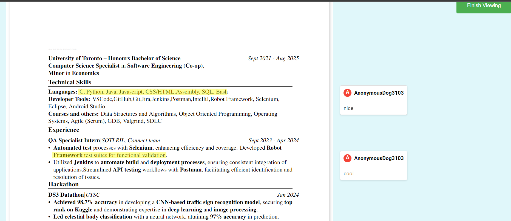
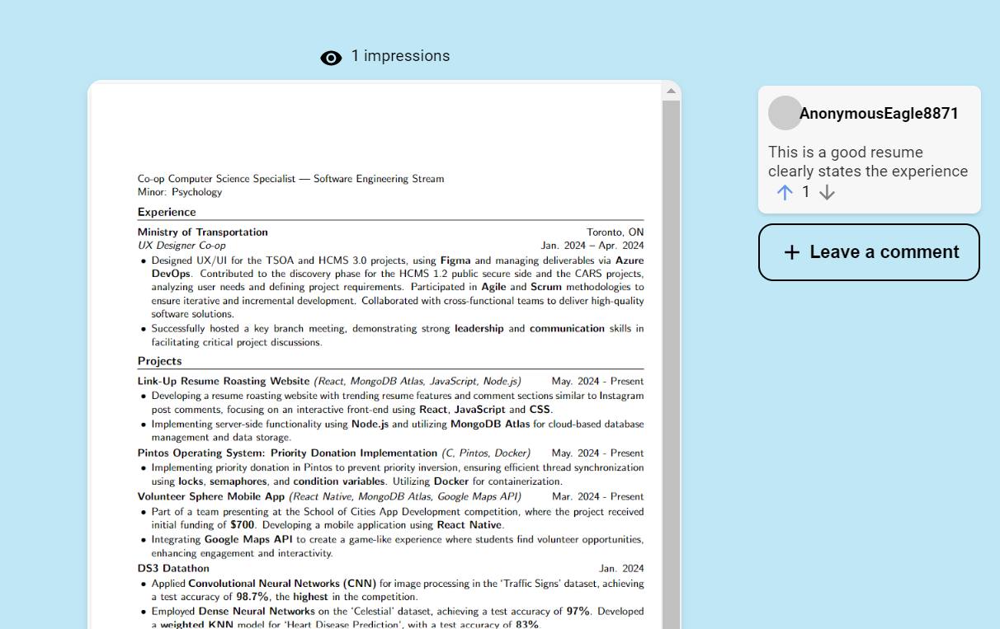
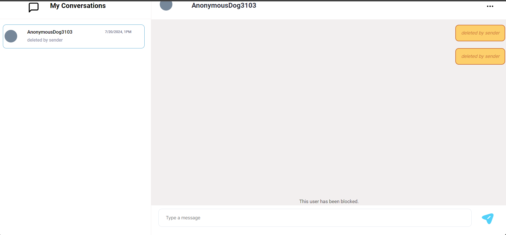
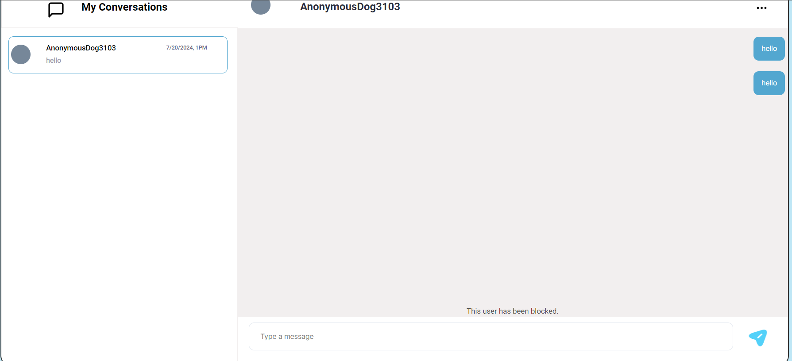
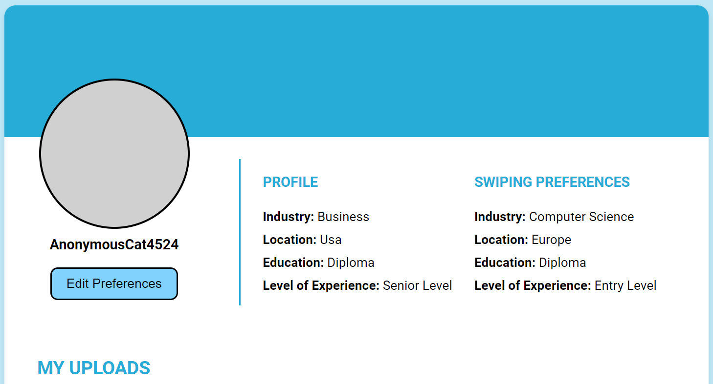

# Link Up

## Iteration 03 - Review & Retrospect

 * When: 18/07/2024
 * Where: Online (discord)

## Process - Reflection

#### Decisions that turned out well

List process-related (i.e. team organization) decisions that, in retrospect, turned out to be successful.

Collaboration

As our app is nearing completion, user stories are becoming increasingly interconnected. To tackle this, we loosely organized subgroups to focus closely on specific areas, one for direct messages and one for resume and matching functionalities. This approach alleviated the burden of tackling complex issues alone. Team members benefited from working closely with others familiar with their area of focus, ensuring timely assistance, greater knowledge sharing, and smoother problem-solving.

Accomodation

During the sprint, a team member had a planned trip, which meant they would be unavailable for a portion of the development cycle. Understanding the situation, the group displayed flexibility by adjusting workloads and the difficulty of tasks accordingly. To ensure that the returning team member could contribute effectively without feeling overwhelmed, we assigned them more achievable tasks that could be completed within the limited time they had.
	
Strategy to retrieve data from database

In the previous sprint, we mentioned that we were going to adjust how  frequently data was fetched to enhance efficiency. For the direct messages page, this adjustment reduced lag when sending and receiving messages, ensuring a smooth user experience with timely feedback for user actions. By fine-tuning the data retrieval process, we minimized server load and improved real-time interaction, which is critical for maintaining user engagement and satisfaction.

#### Decisions that did not turn out as well as we hoped List process-related (i.e. team organization) decisions that, in retrospect, were not as successful as you thought they would be.

Large user stories

One team member was given a user story with too many intricate parts. While the basic idea was clear, the detailed nuances outlined in the Figma design made it difficult to implement within the given timeframe. This overwhelming task led to lots of stress. Realizing the issue, we advised the team member to focus on the core concept of the user story and offered assistance to alleviate the burden

Showing other files in direct messages

Aiming to implement file uploads and displays in direct messages turned out to be an overly ambitious decision in our previous sprint. We are able to display pdfs, as we have used that technology throughout the app. However, the complexity of displaying other file types, such as pictures, videos, and MP3s, is too great for the limited timeframe. After careful consideration, we decided to potentially drop or scale down this feature. For example, a user can upload photos but not videos or MP3s.

Styling inconsistencies

We aimed to standardize styling across the app in previous sprints. For example, standardizing measurements to use vh instead of %. However, as we added more pages and the app's complexity increased, it became increasingly difficult to find the time to revisit and revise previous work to align with the updated styling standards. It has also made it more difficult for team members to edit other member’s stylings.

#### Planned Changes

Collaborate more often

As mentioned earlier, the increasing interconnection of user stories has naturally led to greater teamwork. We hope to continue this trend into the next sprint, particularly as most of the user stories will revolve around resumes and comments. By fostering a collaborative environment, we ensure that team members can easily share knowledge and tackle complex problems together. Through this, we hope to end the final sprint with a very strong product. 

Break down user stories

The large user story previously mentioned highlighted the importance of breaking down large tasks into more manageable segments going into the future. This can involve breaking it down into smaller chunks that several team members can work on, or revising the original design. This would help ensure that workloads are realistic and achievable within the timeframe and restraints of the sprint

## Product - Review

#### Goals and/or tasks that were met/completed:

Leaving comments on resumes (LC-28)
Users are able to highlight text and leave comments on resumes that they swipe right on. When a user clicks “Finish Commenting” ,the resume uploader gets a DM that says they got comments on their resume. If the user accepts then they can keep talking to the other member. If they decline, the textbox and send button disables. The user can also view the comments by clicking on the text to view comments and leave the page by clicking finish viewing as seen in picture.

Leave comments on trending resumes (LC-31)
As a registered user, I can write and publish public comments on trending documents so that I can leave feedback on documents that I may not have seen.
This  allows registered users to engage with the community by writing and publishing public comments on trending documents. This feature encourages interaction and feedback on popular content, enhancing the community experience and fostering discussions on relevant topics.

Deleting Conversations (LC-30)
Users can delete all their messages (deleting conversation), or delete single messages
When a user deletes a message, the other user will be shown that the message has been deleted (similar to WhatsApp). This ensures fair control for both users over their conversation

Block user in dms (LC-36)
Users have the option to block other users to prevent further communication. When a user blocks another user, the blocked user will not be notified that they have been blocked. This feature ensures that users have full control over who can interact with them, maintaining a fair and respectful environment for all participants in the conversation.

Edit Swiping Preferences (LC-32)
Users have the option to edit their swiping preferences whenever. Navigating to the “Your Profile” page, they can click the “Edit Preferences” button to modify their preferences by clicking on an option in the dropdown for each option.

#### Goals and/or tasks that were planned but not met/completed:

Being able to send different file types through direct messages 

This feature was postponed from the previous sprint to this sprint. We were able to implement showing pdfs in direct messages. However, as mentioned in an earlier section, we decided to postpone or potentially drop this feature for other file types due to its complexity

Being able to edit comments on resume

Much like the previous point, this feature will be postponed from the this sprint to the next sprint due to its complexity on top of an already large user story

## Meeting Highlights

Going into the next iteration, our main insights are:

Manage Task Complexity

Based on the issues encountered with large user stories, it's clear that managing expectations and user story size would help our group. For the next sprint, we will focus on breaking down large tasks into smaller, more manageable components that each member can share, as well as prioritizing features to ensure that we stay within realistic timeframes. This approach will help prevent overwhelming one single team member and improve overall productivity.

Enhance Collaboration and Support

The successful collaboration observed in the current sprint should be seen also in the next iteration. With many user stories revolving around resumes and comments, fostering a collaborative environment will be crucial. We will implement regular check-ins and to ensure that team members can support each other effectively against challenges. Moreover, we anticipate that this increased collaboration would make resolving merge conflicts easier. 

Final Presentation Finalizations

As the next sprint will be our final one before presentation, it is crucial that we dedicate significant time to debugging and polishing our code. We want to ensure that all features are thoroughly tested and refined. Also, we will focus on fixing any outstanding issues and ensuring the user experience is pleasant. All of these steps will help ensure we deliver and present a well-made product.

