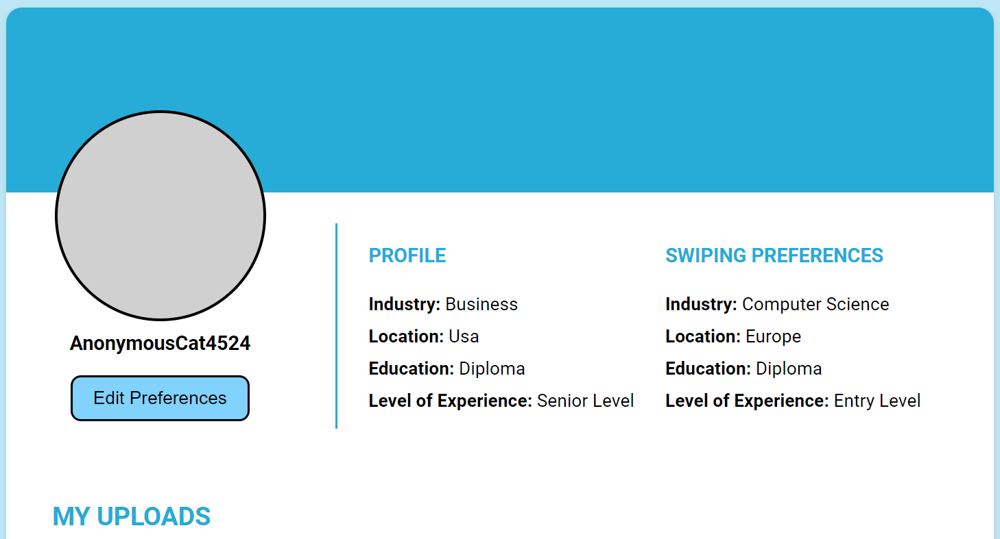
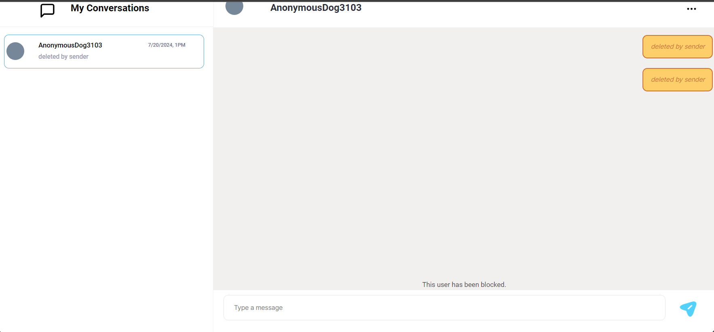
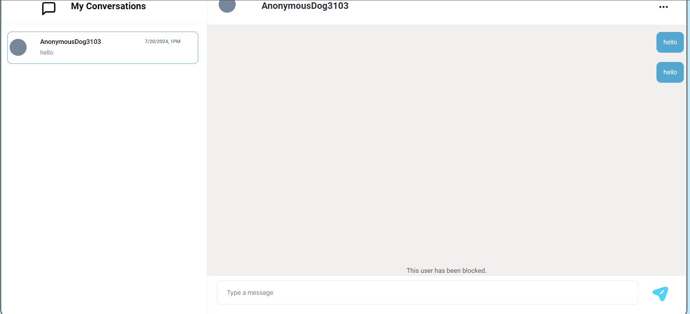
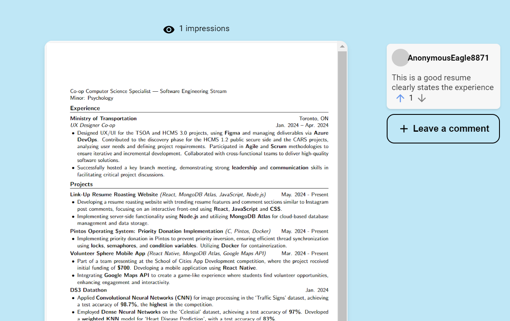

# LinkUp

## Iteration 03

 * Start date:07/07/2024
 * End date: 19/07/2024
## Process

Our process for Linkup involves using agile methodologies to ensure iterative development and continuous improvement. We hold regular planning and review meetings, use a Kanban board to track progress.

#### Changes from previous iteration

The increasing interconnection of user stories has strengthened our teamwork and collaboration. We aim to sustain this collaborative spirit in the upcoming sprint. By fostering a collaborative environment, we want members to share insights and tackle complex challenges together. Our objective is to wrap up the final sprint with a strong, polished product.

List the most significant changes you made to your process (if any).

#### 1. Earlier Branch Merging and Testing * 
**Reason for Change:** We previously faced a major issue where the resume upload feature stopped working due to dependency discrepancies and missing packages after merging multiple feature branches the day before our demo. This made debugging difficult and time-consuming. 
**Expected Outcome:** By merging branches earlier and testing more frequently, we aim to identify and resolve integration issues sooner. 

#### 2. Improved Documentation 
**Reason for Change:** Lack of thorough documentation made it difficult for team members to support each other and resolve blockers, as it was challenging to understand the status and details of each other’s tasks. 
**Expected Outcome:** More thorough and regular documentation will streamline the process of getting familiarized with each other’s work, making it easier to collaborate and assist with blockers. 

#### Roles & responsibilities
Describe the different roles on the team and the responsibilities associated with each role.
The main roles are:
the scrum master: the team member who delegates tasks to members, starts sprints, and ensures that we have completed and prepared all the necessary files and documents for submission
the repository manager: the team member who makes sure other team members are making pull requests, updating issues, and merging and creating branches safely
the developers: team members who are responsible for writing and testing code that they create; they are assigned to a task listed on the KANBAN Jira Board; 
the designers: team member(s) who are responsible for maintaining the Figma prototype, ensuring that all fonts, sizing, and colors are uniform across all pages
the note takers: team member(s) who are responsible for summarizing discussions during in-person or on-call meetings

#### Events

Describe meetings (and other events) you are planning to have:

 * When and where? In-person or online?

We plan to have at least one weekly in-person meeting and conduct online meetings if need be.

 * What's the purpose of each meeting?

The purpose of each meeting is to discuss topics that require everyone’s approval, whether that be changes to the UI of a page or changes to the flow of our app. In addition, we may discuss technical blockers that team members require support with and database management and scaling in consideration of added features to our app. 
Nearing the end of each sprint, we will conduct a code review/merge session where the repository manager will attempt to merge all feature/bugfix branches to the develop branch. During the process, the repository manager may need to consult other team members, where most if not all will be present online or in-person, to resolve merge conflicts. 

#### Artifacts

List/describe the artifacts you will produce in order to organize your team.       

 * Artifacts can be To-do lists, Task boards, schedule(s), etc.
 * We want to understand:
   * How do you keep track of what needs to get done?
   * How do you prioritize tasks?
   * How do tasks get assigned to team members?

We mainly rely on our KANBAN board to track members’ progress on their assigned task. Tasks are prioritized using the label feature within the KANBAN board on Jira, setting the tasks to High, Medium, or Low. They are evaluated based on how integral they are to the app’s core functionality (i.e. whether the app can work with or without accomplishing that task). To keep track of what tasks have been solved, we use the Issues and Pull Requests Tab within our Github repository. Issues listed in our Github repository mostly correspond to the tasks assigned to team members in our KANBAN board. These types of issues will be updated when a team member replies to that issue with the Pull Request link. Then, they will be resolved once the repository managers validates the PR and accepts or rejects the merge depending on the circumstances. Additional issues, such as bug fixes, database table needs to be set up, etc. will be also listed on the Issues tab. These types of issues will be resolved with Pull Request or a written response to that issue. 

#### Git / GitHub workflow

Our team uses a feature-branch workflow to manage our codebase and avoid conflicts. The process is as follows:

1. **Branch Naming:** Branches are named using the format `feat/(Linkup ticket number) - concise name that describes the feature` (e.g., `feat/LC-11-add-login-page`).
2. **Development:** Each feature is developed in its own branch. This ensures that work is isolated and can be reviewed independently.
3. **Pull Requests:** When a feature is ready for review, a pull request (PR) is created from the feature branch to the `develop` branch.
4. **Code Review:** PRs must be reviewed by a team member 
5. **Merging:** Once approved, the PR is merged into the `develop` branch by  a designated team member.
6. **Continuous Integration:** After merging, we test .

**Reason for Workflow:** This workflow ensures that code changes are thoroughly reviewed, reducing the likelihood of introducing bugs. By isolating features in their own branches and using clear naming conventions, we maintain a clean and organized codebase.

## Product

_This entire section is mandatory._

#### Goals and tasks

 * Describe your goals for this iteration and the tasks that you will have to complete in order to achieve these goals.
 * Order the items from most to least important.
 * Feel free (but not obligated) to specify some/all tasks as user stories.
User Stories 
1. Edit Preferences from settings.
2. Comment on resumes 
3. Comment on trending resumes 
4. Delete conversations 
5.Block user in dms 

#### Tasks
1. Edit Preferences from settings. - Matthew
2. Comment on resumes -Keerthiha
3. Comment on trending resumes -Bahar
4. Delete conversations - Ashtian
5. Block user in dms - Vaibhav 

#### Artifacts

List/describe the artifacts you will produce in order to present your project idea.

 * Artifacts can be text, code, images, videos, interactive mock-ups and/or any other useful artifact you can think of.
 * Make sure to explain the purpose of each artifact (i.e. Why is it on your to-do list? Why is it useful for your team?)
 * Be concise, yet precise.         
   For example: "Build the website" is not precise at all, but "Build a static home page and upload it somewhere, so that it is publicly accessible" is much clearer.

### Artifacts
Artifact #1: Figma Prototype
Illustrates every possible page of our “happy path.” Team members can directly refer to our Figma Prototype when building the UI of their designated task(s) or page. In addition, stakeholders can understand our vision for our app–from the app aesthetics to the user flow. 
Artifact #2: Database Design Document
Maps out the relations between schemas. This document showcases our thought process in storing user and resume data. For team members, this document outlines how we should store data, so that when, for example, we need to keep track of the impressions (views) for user resumes, the document will clearly show how to retrieve that information.
Artifact #3: Readme file and other forms of documentation
Act as a one-stop shop for our pitch, means of contribution, running our app, etc. If stakeholders want to learn about our app in a holistic view, our Readme includes our pitch: our purpose and how it works. In addition, if they want to better understand our target users and long-term vision for our app, they can refer to our product.md file and our personas. If they want to contribute to our long-term vision, they can refer to the Contributions section in our Readme file to learn how to responsibly contribute to our codebase. 

For Sprint 3
#### LC-32
As a registered user, I want to be able to edit my preferences so that I can modify my swiping experience whenever.
**Purpose:** 
It is focused on allowing users to have control over their preferences within the application. By enabling users to edit their preferences, they can tailor their swiping experience to better match their interests and needs, ensuring a more personalized and satisfactory user experience.

#### LC-30

 As a registered user, I want to delete conversations with users that I have matched with so that I can manage my chat history.
**Purpose:**
This ticket addresses the need for users to have the ability to manage their chat history by deleting conversations. This feature helps users maintain their privacy, declutter their chat interface, and remove any unwanted or outdated conversations.

#### LC-36

As a registered user, I can block users that I have matched with so that I can prevent users from talking to me.
**Purpose:**
The focus of this ticket is to provide users with the capability to block other users they have matched with. This is crucial for ensuring user safety and comfort by allowing them to prevent unwanted communication and interactions from specific users.

#### LC-28

As a user, I want to be able to leave comments on the document of the user that I have swiped right on.
**Purpose:**
This enables users to leave comments on the documents of users they have shown interest in by swiping right. This feature facilitates further interaction and engagement between users, allowing them to express their thoughts or feedback directly on the documents.

#### LC-31
As a registered user, I can write and publish public comments on trending documents so that I can leave feedback on documents that I may not have seen.
**Purpose:**
This  allows registered users to engage with the community by writing and publishing public comments on trending documents. This feature encourages interaction and feedback on popular content, enhancing the community experience and fostering discussions on relevant topics.

