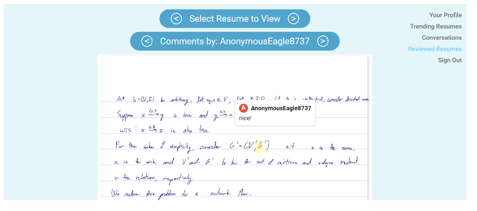
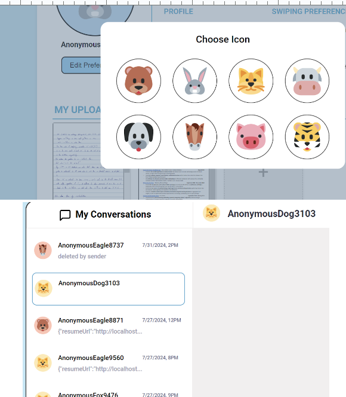
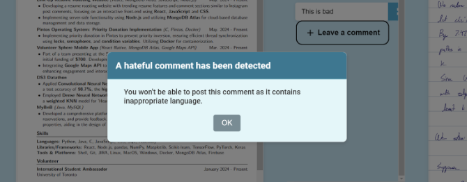
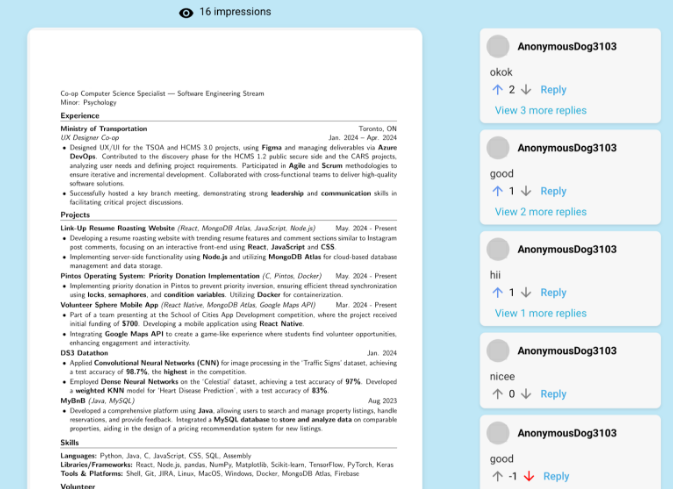
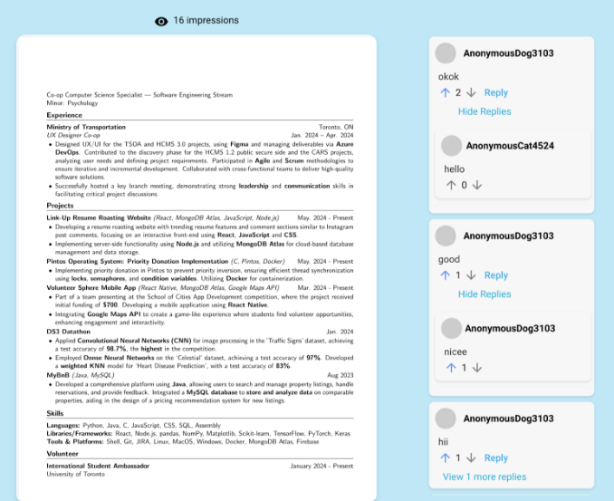
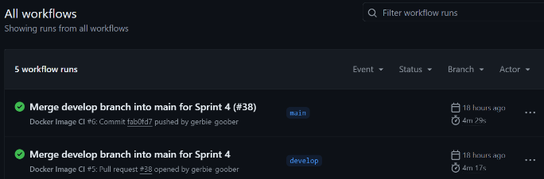

# Link Up

## Iteration 04 - Review & Retrospect

 * When: 01/08/2024
 * Where: Online (discord)
All participants were present during the sprint review meet

## Process - Reflection

#### Decisions that turned out well

List process-related (i.e. team organization) decisions that, in retrospect, turned out to be successful.

Incremental Merging

In previous sprints, we merged all branches at once in a single meeting, allowing members lots of time to complete their tasks. However, as our tasks became more intertwined with each other, this led to stress and confusion during merging. It became difficult for the main person that was merging to discern which code from which branch to keep. For this sprint, we switched to incremental merging of related features. This approach reduced stress, as members were more familiar with their own code and could resolve conflicts earlier. 
	
Breaking down tasks

Building on lessons from the previous sprint, we aimed to avoid overloading team members with challenging tasks to reduce stress. Instead of waiting for someone to offer help in the group chat, we assigned specific members as designated helpers for particularly difficult tasks. This approach ensured that support was proactively provided and improved overall team efficiency.

#### Decisions that did not turn out as well as we hoped List process-related (i.e. team organization) decisions that, in retrospect, were not as successful as you thought they would be.

Using Redis

From the previous sprint, we decided to use Redis for caching trending resumes to have effective, real-time data retrieval, ensuring that the most current and popular resumes are displayed with minimal latency. However, a downside is that anyone wanting to try our app needs to download Redis on their local machine. Unlike an npm package, Redis cannot be installed with a simple npm install. Additionally, before running our app, the Redis server must be started. This makes the process of setting up and starting our app a bit more cumbersome overall

Overemphasis on standardized styling

In the previous sprint, we aimed to standardize styling across all pages. For example, using the same measurements. However, we soon realized that this task would be more time-consuming than anticipated. The effort required to overhaul the styling would have significantly reduced the time available for coding and implementing features. As a result, we decided not to pursue this change in the current sprint to focus on our core development tasks.

#### Planned changes

Using Docker for Redis 

Docker would run Redis in an isolated container. This approach ensures that services from Redis are configured consistently and gets rid of the need for manual installation on local machines. With Docker, you can easily start and manage Redis and MongoDB, making it straightforward for anyone to run the app

## Product - Review

#### Goals and/or tasks that were met/completed:

Viewing comments left on resumes (LC-29)
A user can go through all their resumes
For each resume, a user can go through comments left by others individually

Profile pictures customization and display (LC-37)
A user can change their profile picture by clicking their on the profile page

Filtering out hateful comments on trending resumes and on resume commenting page (LC-33)

Upvote/downvote the public comments on the trending resume page  (LC-35)

Reply comments on the trending resume page (LC-34)

CI/CD Processes

#### Goals and/or tasks that were planned but not met/completed:

Profile pictures beside messages

In our Figma file, we initially planned to display a user’s profile picture beside their first message in a message chain. However, we decided instead to display profile pictures in separate blocks. It was challenging to determine the start and end of a message chain with the way messages were set up.

## Meeting Highlights
We are preparing for our final presentation on august 6th. 
